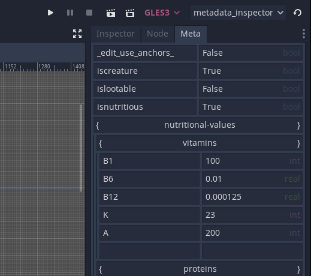
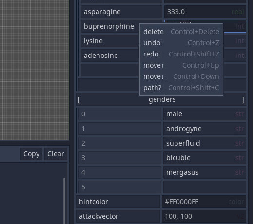

Metadata-Inspector
==================

This Godot 3.2 / 3.1 Plugin allows you to view and edit hidden Metadata.

You can use this most effectively to add custom variables to any node you want without using or attaching any scripts.

 

INSTALL
-------

1. Put metadata-inspector folder into [urproject]/addons/
2. Go Project -> Project Settings -> Plugins and activate Metadata Inspector

TODO
----
- implement a search browser

NODO
----
- update metadata at runtime (remote variable)

HOW TO USE
----------

1. Choose the "Meta" tab next to the Inspector & Node tab (upper right corner)
2. Now you can enter a key (left side) : value (right side) pair 
3. When right-clicking the key textbox, you will get a "control menu" for the entry (delete, undo, redo, move up/down, copy path)
4. When right-clicking the value textbox, you will get a menu to change the type of the value (this includes dictionary and array)
5. If you didn't choose a type, Metadata Inspector will auto-detect the type (1 is int, 1.0 is real, False is bool, #FF00FF is color, 1.0,1 is Vec2 and so forth)
6. Press Enter
7. Now you can copy the absolute path to the entry to your clipboard from the control menu and use it in other scripts
8. The functions to manipulate metadata are documented in Godot in the class Object (has_meta(), get_meta(), get_meta_list(), set_meta(), remove_meta())

You shouldn't touch underscored stuff that was already there, it is from the engine and might break things.

LICENSE
-------
MIT
